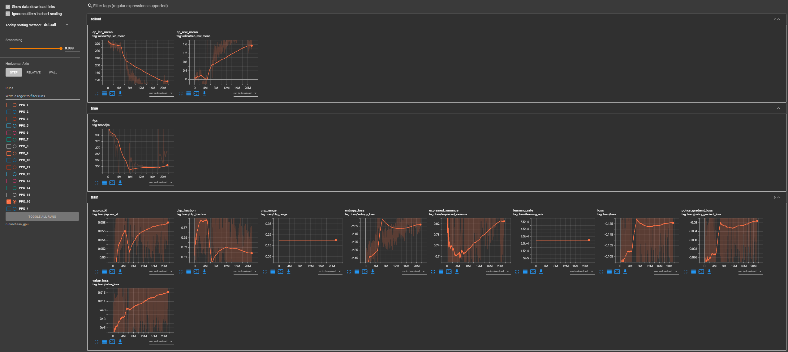

Installed libraries:

stable-baselines3, provides existing RL agent
    
gymnasium, provides ability to incorporate custom environments
    
python-chess, provides legal moves and is the environment we will use gym to learn on

Building a completely and purely Reinforcement Learning approach for Chess. Using no form of predictive or simulative future sight to select optimal moves and instead starting solely with a mask that allows for the selection of only legal moves and seeing how far RL models can get in Chess. Currently, at 20 Million simulated steps and using a randomized opening position to increase generalization still in purely Self Play

This images shows the results of Run16 which included a movement penalty, increased exploration (by raising of the ent_coef) as well as a tweaking of the capture rewards. At 6M randomized openings were intitally introduced to break deadlock of immediate, memorized checkmate. 

After increasing the scope of the random openings to force the bot to play in more complex and variable positions, I introduced a capped stockfish bot at 1320 elo to continue the training. 

![Stockfish Reward Curve]
